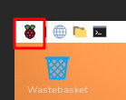
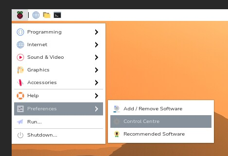
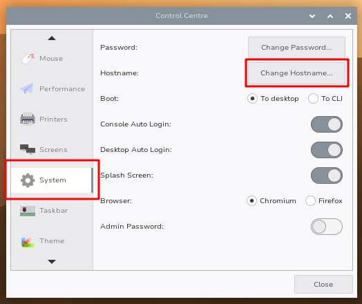
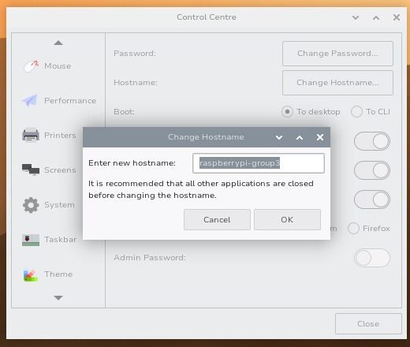
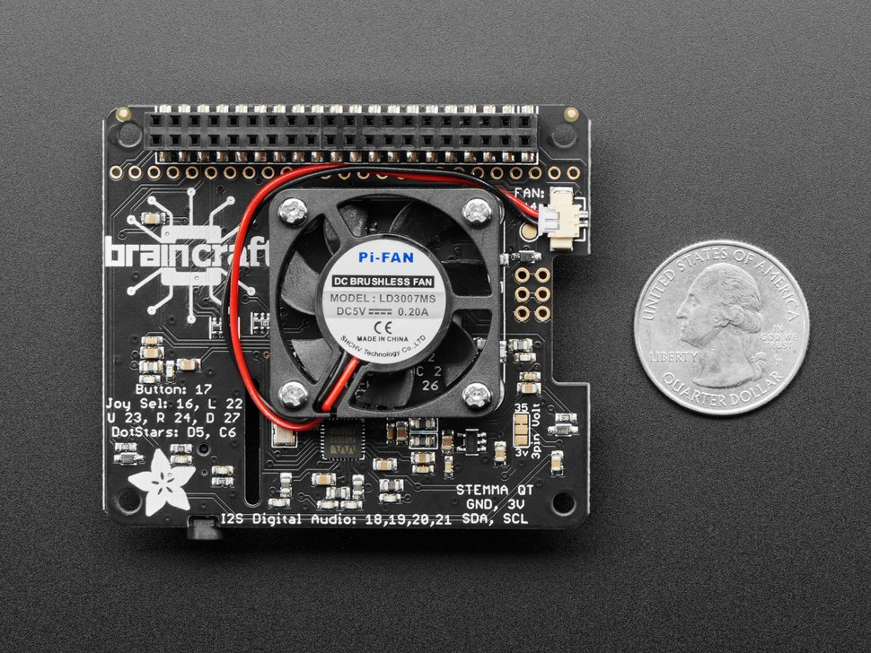
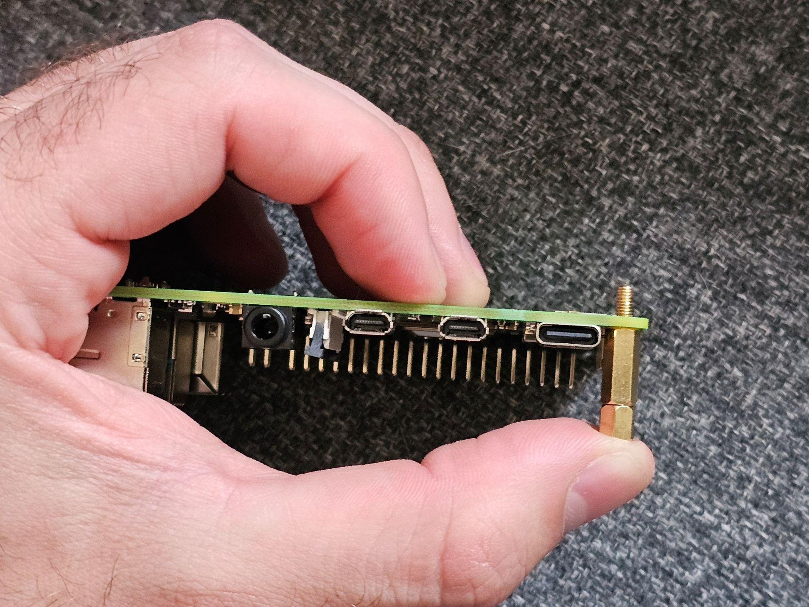
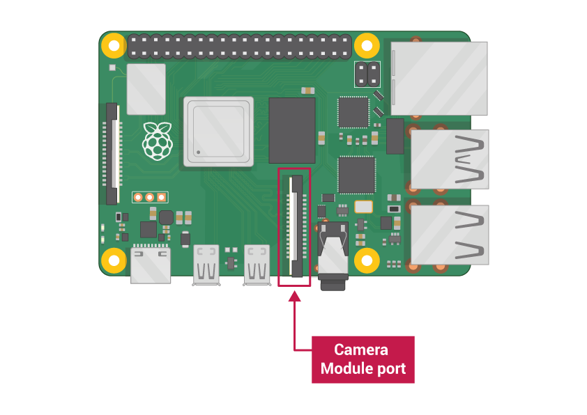
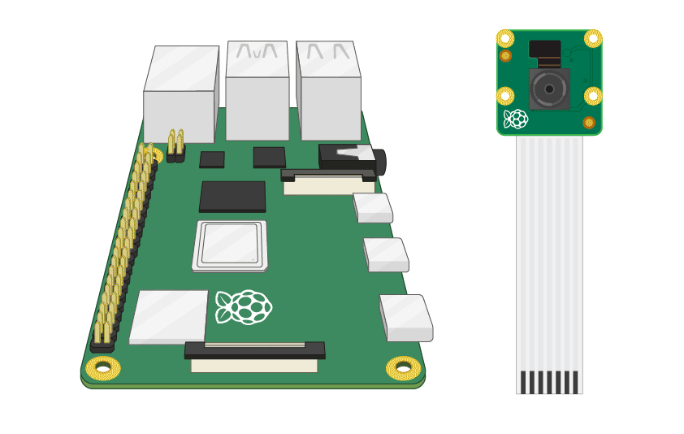
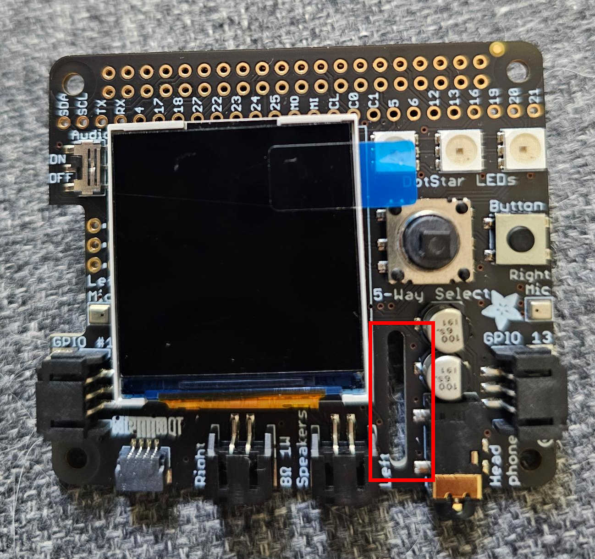

# Raspberry Pi Setup

This guide will help you set up your Raspberry Pi by:

1. [Initial Raspberry Pi Setup](#initial-raspberry-pi-setup)
1. [Connecting to the WiFi](#connect-to-the-wifi)
2. [Install the Camera on the Raspberry Pi](#install-the-camera-on-the-raspberry-pi)
3. [Install the BrainCraft Hat on the Raspberry Pi](#install-the-braincraft-hat-on-the-raspberry-pi)
4. Running your machine learning model on the Raspberry Pi

# Materials
You should have been given 1 of each by instructors:

- [Raspberry Pi 4 B ](https://www.adafruit.com/product/4296) (minimum 4gb RAM)
- [Raspberry Pi Camera Board](https://www.adafruit.com/product/3099)
- [BrainCraft Hat](https://www.adafruit.com/product/4374)
- [2 x 20 Socket Riser Header](https://www.amazon.com/dp/B07PPD25MK?psc=1&ref=ppx_yo2ov_dt_b_product_details)
- 2x 18mm spacers 
- [Power supply compatible with Raspberry Pi 4](https://www.adafruit.com/product/4298)
- [microSD card with adapter 16 GB](https://www.adafruit.com/product/2693)
- [Micro SD Card Reader](https://www.adafruit.com/product/939) (optional)
- [USB C to USB A Adapter](https://www.adafruit.com/product/5030) (optional)

# Initial Raspberry Pi Setup
Before we begin you need to get your Raspberry Pi ready and turn it on:

1. Put the SD card in to the Raspberry Pi's SD card port
     
   _([Image credits](https://researchparent.com/raspberry-pi-computer-building-for-kids/))_
  - Flip your Raspberry Pi over so it is upside-down
  - There should be a metal rectangle on the edge of the board, this is the SD card port
  - Pick up your SD card (being careful to avoid touching the gold parts on the end)
  - Flip it so the gold contacts are facing the Raspberry Pi 
  - Insert the SD card into the SD card port
  - Gently nudge the SD card into the port to make sure it is secure
2. Plug the Raspberry Pi in to power  
    
  - Plug the USB C power cable you have in to the power port indicated by the red arrow in the photo above
  - The red and green LEDs next to the port should turn on and flash every once and a while

# Connect to the Wifi
The first thing we need to do is connect to the Wifi. To do this we need to talk to the Raspberry Pi directly.

1. Install a remote desktop viewer program on your computer:
  - If you are on Windows, Mac, or Linux install [TigerVNC](https://tigervnc.org/)
    - Go to the releases page of the website
    - Find the latest release
    - Follow the link to the "latest binaries"
    - If you are on Windows download the file ending in `.exe`, if you are on Mac download the `.dmg` file
  - If you are on Android or iOS install [MultiVNC](https://github.com/bk138/multivnc)
    - Scroll down to the "How to get it" section on the website
    - Click the button for your platforms app store 
    - Install the app
2. Make sure your Raspberry Pi is turned on
3. Take an Ethernet cord and plug it into your Raspberry Pi and your computer  
   - Be sure the cord is firmly plugged in to both devices!
     - You should hear a click when you plug it in
     - Lights on the Ethernet port of the Raspberry Pi should turn on when the cord is plugged in
4. Wait 2 minutes. The Raspberry Pi has to turn on and get ready
5. Open your remote desktop viewer program (either TigerVNC or MultiVNC)
  - Enter `raspberrypi.local` as the address of the device you wish to connect to
  - The username is `pi`
  - The password is `password`
  - You should now see a desktop with a few icons:
    
  - In the top right of your screen there should be one of these symbols:  
      
    
    - Click the symbol
      - If you do not see this symbol then follow these [Raspberry Pi Connect to Wifi Via Terminal](./raspberry-pi-connect-to-wifi-via-terminal.md) instructions  
        **Only follow these if you do not see the indicated symbol**
    - Then connect to the Wifi
    - Click the browser icon in the top left of the screen  
      
    - Ensure you have internet access by going to a website in the browser
  - Change the name of your Raspberry pi  
    - The new name of your Raspberry Pi will be `raspberrypi-group<n>` where `<n>` is your group number (For example if you are in group 3 your new Raspberry Pi name is `raspberrypi-group3`)  
    - Click the Raspberry icon in the top left to open the home menu:  
      
    - Then hover over the "Preferences" menu and click on "Control Centre"  
        
      It may take a moment to load
    - On the left of the settings window that pops up click on the "System" section (you may have to scroll or use the arrows at the bottom of the window to find this section), then click on the "Change Hostname" button:  
      
    - In the window that pops up enter your new hostname:  
        
      **Be sure to enter __your team's__ hostname here**  
      ```
      raspberrypi-group<n>
      ```
      Where `<n>` is your group number.  
      Then click "OK".
    - Click the close button in the settings app (in the bottom right)
    - A menu will then show asking if you want to reboot, select yes
    - Wait for the Raspberry Pi to reboot
6. Get the IP of your raspberry pi
  - Open a terminal  
    
  - Type the following then hit enter:
    ```bash
    hostname -I
    ```
  - You should see an IP address (a series of numbers separated by dots)  
    
  - Write this IP address down somewhere, share it with your teammates as well
  - Any time you see the text: `<IP>` in instructions replace that text with your Raspberry Pi's IP address
7. Disconnect from the Raspberry Pi in your remote desktop viewer program
8. Disconnect the ethernet cable from your computer and the Raspberry Pi
9. Make sure your computer is connected to the same Wifi network that you connected your Raspberry Pi to (Make sure your computer has internet acess on this Wifi network)
10. Reconnect to your Raspberry Pi but this time use the `<IP>` you found
  - It should work the same as before
  - Now that both your computer and the Raspberry Pi are on the same Wifi you can access it using the `<IP>` instead of needing an Ethernet cable 

# Install the Camera on the Raspberry Pi
Before plugging in or unplugging anything always ensure your Raspberry Pi is off and disconnected from power.

## Connect the Fan
Some kits come with the fan already assembled, while some do not have a fan attached yet.

If the fan is attached to your Braincraft HAT then skip this section.

1. Carefully position your Braincraft HAT screen side down
2. Take off the orange hole protector stickers from the board  
   (Some boards may not have orange hole protectors, if the holes to put the screws are not obscured then skip this step)
3. Take your fan from its packaging and connect the wires into the small connector that says FAN: P4
4. The Red wire should face the large black plastic connector
4. Once this is connected position your fan on the middle of the board aligning the holes
5. Position the wire so it is not pinched under the fan, and carefully attach the screws firmly, but not too tight
6. You should be using the screws that _do not_ come with the small nuts (don’t use the nuts)
7. Now your fan should be installed and look like this:  
   

## Joystick Cover
Some Braincraft HAT kits come with a plastic joystick cover, check if it is already installed:

If the joystick is installed the front of your Braincraft HAT will look like this:


If the joystick is not installed the front of your Braincraft HAT will look like this:


To install the joystick cover simply take the part:


And press it on to the joystick.

## Spacers
None of these steps should require that much strength or force to complete. If you feel yourself trying really hard to screw something in, then unscrew the item and try again. Encountering a lot of force while screwing in means the part is not aligned properly.

1. Locate the two holes on the Raspberry Pi circuit board on the side opposite from the pins:  
   
2. Put one spacer in each hole, the pointy side of the spacer that looks like a screw should go through the hole  
   
3. Thread a nut on the bottom side of the spacer under the Raspberry Pi board. Tighten it until the nut is touching the circuit board. Do not tighten it too much, you should be able to wiggle and rotate the spacer around  
   
4. Once complete your Raspberry Pi should look like this:  
   

## Connect the Camera

1. Orient both your Raspberry Pi and Braincraft HAT as shown in this photo:  
   
   - The row of pins on the Raspberry Pi should be on the bottom, the USB and Ethernet ports on the left, and the spacers you should put on should be on the top
   - The joystick on the Braincraft HAT should be on the left and the row of ports should be on the top
2. Locate the Camera Module port on the Raspberry Pi  
   
3. Connect the camera cable  
   
  - Gently pull up on the edges of the port’s plastic clip
  - Insert the Camera Module ribbon cable through the Braincraft HAT camera cable slot:
      
  - Make sure the blue side of the cable is facing the Ethernet ports on the Raspberry Pi (The blue side should face **left**)
  - Insert the cable into the camera slot on the Raspberry Pi
  - Push the black plastic clip back into place firmly, but make sure you’re pressing it down vertically. This part is tricky so be careful!
4. After completing these steps your Raspberry Pi, Braincraft HAT, and camera should look like this:
   
   
## Attach the Braincraft HAT
Your camera should be attached to the Raspberry Pi, and its cable should be going through the hole in your Braincraft HAT.

1. Carefully align the Braincraft HAT's plastic connector over the pins on your board so the hat is covering the majority of the Raspberry Pi
   
   
2. Firmly press down to make sure the components are connected 
  - Be careful to only push straight down, we don't want to bend any pins

Congratulations, your Braincraft board, camera, and fan are installed!
Your hardware should look something like this now:

  
  


## Test Camera
Now that everything is all assembled plug in your Raspberry Pi and let's test out the camera and screen!

1. Give your Raspberry Pi a few moments to start up, once it has finished you should see a mini version of the desktop you saw earlier
2. Open `http://<IP>:7681` in your browser, this is a terminal where you can run commands on your Raspberry Pi
3. Paste this command into the terminal:
   ```bash
   DISPLAY=:0 rpicam-hello --timeout=0
   ```
   You should now see the output of your camera on the mini screen!  
   Hit Control and `c` at the same time to end this preview program
